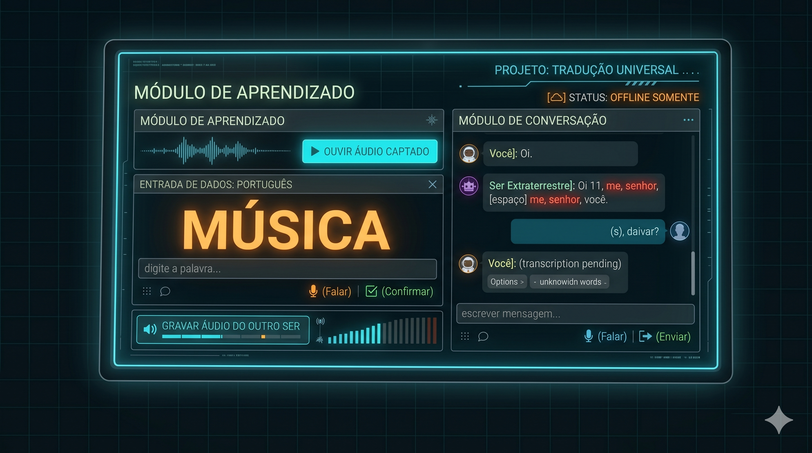

# Project Hail Mary - Universal Translator / Tradutor Universal



<details open>
<summary><h2>🇺🇸 English Version (Click to expand)</h2></summary>

An autonomous Universal Translator inspired by the book *Project Hail Mary* (Andy Weir). This system is designed to listen to unknown languages (be it human speech, alien clicks, musical chords, or animal sounds), catalog them, and translate them in real-time using Metric Learning Neural Networks and Vector Databases.

### 🚀 The Architectural Journey: Learning from Our Mistakes

Building a true Universal Translator is not just about speech-to-text. It's about finding conceptual and phonetic similarity between completely disparate sounds. Here is the engineering journey that led to our final architecture:

#### ❌ Attempt 1: Mean MFCCs (13 to 20 Dimensions)
* **The Idea:** Extract the Mel-Frequency Cepstral Coefficients (MFCCs) and take the average across the entire audio clip.
* **The Failure:** Taking the average destroys the *timeline* of the audio. "Cat" and "Tac" look exactly the same. We found that completely different words (like "Food" and "House") were matching with 94% similarity because their average frequencies were similar.

#### ❌ Attempt 2: Base Fixed-Size Spectrogram (1024 Dimensions)
* **The Idea:** Convert the audio into a 2D "thermal image" of sound (Spectrogram) and mathematically resize it to a fixed 32x32 grid (1024 flat numbers) to preserve time and solve fast/slow speakers.
* **The Failure:** The time grid was too rigid. If the microphone captured a random mouse click right before the word was spoken, the entire word was shifted forward in the grid. Similarity dropped to an abysmal 36% for the exact same word.

#### ❌ Attempt 3: Statistical MFCCs (60 Dimensions)
* **The Idea:** Extract Mean, Standard Deviation, and Maximum peak for 20 MFCC bands.
* **The Failure:** The statistical normalization (Z-score) flattened the data so much that the model became "nearsighted". It couldn't tell the phonetic difference between words anymore.

#### ❌ Attempt 4: The Neural Network Siren Song (CLAP Model - 512D)
* **The Idea:** Use a state-of-the-art AI (LAION's CLAP) trained on millions of sounds to extract the ultimate noise-immune embedding.
* **The Monumental Failure (The Semantic Trap):** CLAP is a *semantic* classifier, not a phonetic one. When you say "Food" and "House", it classifies BOTH as **"Human Speech"**! The AI gave the exact same high score (0.78) for totally different words because, semantically, the sound meant the same thing (a human talking). Commercial AIs destroy alien phonetics.

#### ❌ Attempt 5: Evolved Spectrogram + Smart RMS Trimmer (1024D)
* **The Idea:** Return to the Pure Math of the 32x32 grid, but precisely cropping the start and end of the word using an RMS energy detector to center the sound and avoid shift sensitivity.
* **The Failure:** Direct mathematical comparison is still "literal". It compares frequency by frequency. If a human says "Dog" and a gorilla or alien makes the equivalent "Dog" sound, their physical frequencies are orthogonal. Pure math says they are 0% similar, failing to bridge different vocal physiologies.

#### ✅ The Definitive Solution: Hybrid Siamese Neural Network with Triplet Loss (1024D)
To force the system to map the gorilla grunt, the alien noise, and the human speech representing "Dog" to the exact same concept, we abandoned literal acoustics and created a **Siamese Neural Network** based on MobileNetV2:
* **Triplet Loss (Cosine Distance):** The network is trained using audio triplets (Human Anchor, Alien Positive, Alien Negative). The loss function forces the AI to bring vectors with the same meaning closer together on the unit sphere, while pushing different concepts apart.
* **Synthetic Data Augmentation:** If you only have one recording of a word, the system automatically injects Gaussian white noise and varies the volume to create robust positive pairs, preventing representation collapse.
* **Hybrid Architecture (Local/Modal.com):** Training can run **locally** on your RTX GPU (via CUDA 12.1) in 2 seconds or on the **cloud** by streaming tensors directly via API to a T4 GPU on **Modal.com** in 3 seconds.
* **Safe Offline Inference:** Translation and feature extraction run 100% offline on the **CPU**. This resolves the cuDNN DLL conflicts with Whisper's engine (`faster-whisper`), while making the microphone initialize instantly.

---

### 🔄 Project Workflow (How to Use)

To run and feed the Universal Translator, follow these 4 steps:

#### Step 1: Teach a New Voice (Recording)
Register voices and words by running the vocabulary learning script:
```bash
venv\Scripts\python.exe scripts/learn_vocabulary.py
```
* **What happens:** The console will ask which word you want to register (e.g., `DOG`) and the language (e.g., `ingles`). Next, record your voice saying the word. If you want to register an alien sound, run it again setting the language to `clingo` (or `elvish`, `klingon`, etc.) and record the alien sound.

#### Step 2: Train the Translator's "Brain"
Update the Siamese Network's weights with the newly recorded voices:
```bash
venv\Scripts\python.exe scripts/train_siamese.py
```
* **Configuration:** Change the `TRAINING_MODE` variable in `src/config.py` to choose between `"local"` (RTX GPU) or `"cloud"` (Modal.com T4 GPU). Running the script will recalculate the model's weights and save them to `models/siamese_universal_translator_1024d.pth`.

#### Step 3: Rebuild the Vector Database
Generate the new high-dimensional vectors and store them in the index:
```bash
venv\Scripts\python.exe scripts/migrate_to_vector_db.py
```
* **What happens:** This script wipes the old ChromaDB and converts all local audio files to 1024D vectors in milliseconds using the model trained in Step 2.

#### Step 4: Real-Time Translation
Start the translator and talk into the microphone:
```bash
venv\Scripts\python.exe scripts/translate_audio.py
```
* **What happens:** The system opens your microphone. Select the listening language (e.g., `ingles`). When you speak, it queries ChromaDB using Cosine Distance and outputs the translation instantly on your screen.

---

### 🛠️ Architecture
- **Audio Brain:** MobileNetV2 Siamese Network + Mel Pipeline + RMS Trimmer.
- **Hybrid Training:** Local (GPU CUDA) or Cloud Serverless (Modal.com T4 GPU).
- **Memory/Vector DB:** `ChromaDB` (HNSW space with cosine similarity).
- **Relational DB:** `SQLite` for cataloging vocabulary and metadata.
- **Human Interface:** `faster-whisper` (Whisper model 'small' on CPU).

### 💻 How to Run (Installation)
1. Install dependencies: `pip install -r requirements.txt`
2. **Modal Setup (Only if using cloud mode):** `venv\Scripts\modal.exe setup`

</details>

<br>

<details>
<summary><h2>🇧🇷 Versão em Português (Clique para expandir)</h2></summary>

Um Tradutor Universal autônomo inspirado no livro *Devoradores de Estrelas / Project Hail Mary* (Andy Weir). Este sistema foi projetado para ouvir e parear idiomas desconhecidos (seja fala humana, cliques alienígenas, acordes musicais ou vocalizações animais), catalogando-os e traduzindo-os em tempo real usando Inteligência Artificial de Métricas e Bancos de Dados Vetoriais.

### 🚀 A Jornada de Arquitetura: Aprendendo com Nossos Erros

Construir um verdadeiro Tradutor Universal não é apenas sobre transcrever voz para texto (STT). É sobre encontrar similaridade conceitual e fonética entre sons completamente díspares. Aqui está a jornada de engenharia que nos levou ao motor final:

#### ❌ Tentativa 1: Média de MFCCs (13 a 20 Dimensões)
* **A Ideia:** Extrair os Coeficientes Cepstrais de Frequência Mel (MFCCs) e tirar a média de todo o áudio.
* **A Falha:** Tirar a média destrói a *linha do tempo* do áudio. Para o computador, "Food" e "House" pareciam a mesma coisa. Palavras diferentes davam *match* com 94% de similaridade porque suas frequências médias gerais eram parecidas.

#### ❌ Tentativa 2: Espectrograma Mel Base (1024 Dimensões)
* **A Ideia:** Converter o áudio em uma "imagem térmica" 2D do som (Espectrograma) e redimensionar matematicamente para uma grade fixa de 32x32 (1024 números) para preservar o tempo e resolver falantes rápidos/lentos.
* **A Falha:** A grade de tempo ficou rígida demais. Se o microfone captasse um clique aleatório do mouse pouco antes da palavra ser falada, a palavra inteira era "empurrada" na grade 32x32. A similaridade caía para 36% mesmo sendo a mesma palavra.

#### ❌ Tentativa 3: MFCCs Estatísticos (60 Dimensões)
* **A Ideia:** Extrair Média, Desvio Padrão e Pico Máximo. Isso capturaria a "textura" do som sem depender de uma linha do tempo rígida.
* **A Falha:** A normalização (Z-score) achatou os dados. O modelo ficou "míope" e não conseguia mais notar a diferença fonética entre as palavras.

#### ❌ Tentativa 4: O "Canto da Sereia" da Rede Neural (Modelo CLAP - 512D)
* **A Ideia:** Usar uma IA de ponta (CLAP da LAION) treinada com milhões de áudios para extrair a "alma" do som imune a ruídos.
* **A Falha Monumental (A Armadilha Semântica):** O CLAP é um classificador *semântico*, não fonético. Quando você fala "Food" e "House", ele classifica ambos como **"Voz Humana"**! A IA deu exatamente a mesma pontuação (0.78) para palavras totalmente diferentes, porque para ela o som significava a mesma coisa (um humano falando). Redes Neurais Comerciais destroem a fonética alienígena.

#### ❌ Tentativa 5: Espectrograma Evoluído + Smart RMS Trimmer (1024D)
* **A Ideia:** Voltar para a Matemática Pura da grade 32x32, mas recortando milimetricamente o início e o fim da palavra com um detector de energia RMS para centralizar o som e evitar o deslocamento por ruídos.
* **A Falha:** A comparação matemática direta ainda é "burra e literal". Ela compara frequência por frequência. Se um humano fala "Dog" e um gorila ou alienígena emite o som equivalente a "Dog", suas frequências físicas são ortogonais. A matemática diz que a similaridade é zero. Ela é incapaz de mapear intensões semânticas de corpos vocais diferentes.

#### ✅ A Solução Definitiva: Rede Neural Siamesa Híbrida com Triplet Loss (1024D)
Para que o sistema entenda que o grunhido do gorila, o ruído alienígena e a voz humana de "Dog" significam a mesma coisa, abandonamos a comparação física e criamos uma **Rede Neural Siamesa (Siamese Network)** baseada no MobileNetV2:
* **Triplet Loss (Distância Cosseno):** A rede é treinada mostrando trios de áudio (Âncora Humana, Positivo Alienígena, Negativo Alienígena). A matemática da loss força a IA a aproximar no espaço vetorial os sons com o mesmo significado (deformando os vetores até se sobreporem), enquanto empurra os sons diferentes para longe.
* **Aumento Sintético de Dados (Data Augmentation):** Caso você tenha apenas um áudio gravado para a palavra, a IA injeta automaticamente ruído branco gaussiano e varia o volume para criar pares positivos sintéticos robustos, impedindo o vício da rede.
* **Arquitetura Híbrida (Local/Modal.com):** O treinamento pode ser feito **localmente** na sua GPU RTX (via CUDA 12.1) em 2 segundos ou na **nuvem** enviando os tensores diretamente por API para uma GPU T4 do **Modal.com** em 3 segundos.
* **Inferência Offline Segura:** A tradução e leitura ocorrem 100% offline e na **CPU** do seu PC. Isso resolve o conflito de cuDNN com as DLLs do Whisper (`faster-whisper`), além de inicializar o microfone instantaneamente.

---

### 🔄 Fluxo de Trabalho (Como Usar o Tradutor)

Para rodar e alimentar o Tradutor Universal no seu dia a dia, siga os 4 passos abaixo:

#### Passo 1: Ensinar uma Nova Voz (Gravação)
Cadastre as vozes e palavras no sistema rodando o script de aprendizado:
```bash
venv\Scripts\python.exe scripts/learn_vocabulary.py
```
* **O que acontece:** O terminal vai perguntar qual palavra humana você quer cadastrar (ex: `DOG`) e qual idioma (ex: `ingles`). Em seguida, grave a voz falando a palavra. Se você quiser cadastrar uma versão alienígena, rode novamente definindo o idioma como `clingo` (ou `elvish`, `klingon`, etc.) e grave o ruído bizarro da palavra.

#### Passo 2: Treinar o "Cérebro" do Tradutor
Atualize a inteligência da Rede Siamesa com as novas vozes gravadas:
```bash
venv\Scripts\python.exe scripts/train_siamese.py
```
* **Ajuste Fino:** Altere a variável `TRAINING_MODE` em `src/config.py` para escolher entre `"local"` (RTX GPU) ou `"cloud"` (GPU T4 do Modal). Ao rodar o script, os pesos da IA serão recalculados e salvos localmente em `models/siamese_universal_translator_1024d.pth`.

#### Passo 3: Sincronizar o Banco Vetorial
Gere os novos vetores matemáticos para todos os áudios e salve-os no banco indexado:
```bash
venv\Scripts\python.exe scripts/migrate_to_vector_db.py
```
* **O que acontece:** O script limpa o ChromaDB antigo e converte em milissegundos todos os áudios locais em vetores de 1024D usando o cérebro treinado no Passo 2.

#### Passo 4: Traduzir em Tempo Real
Abra o tradutor universal e fale no microfone:
```bash
venv\Scripts\python.exe scripts/translate_audio.py
```
* **O que acontece:** O sistema abrirá o microfone. Escolha o idioma de escuta (ex: `ingles`). Ao falar no microfone, ele fará a busca vetorial via Distância Cosseno no banco gerado no Passo 3 e retornará a tradução instantaneamente na tela.

---

### 🛠️ Arquitetura
- **Cérebro de Áudio:** Rede Siamesa MobileNetV2 + Pipeline Mel + RMS Trimmer.
- **Treinamento Híbrido:** Local (GPU CUDA) ou Nuvem Serverless (Modal.com T4 GPU).
- **Memória Vetorial:** `ChromaDB` (Espaço HNSW com similaridade de cosseno).
- **Banco Relacional:** `SQLite` para catalogar vocabulário e metadados.
- **Interface Humana:** `faster-whisper` (Whisper model 'small' em CPU).

### 💻 Como Executar (Instalação)
1. Instale as dependências: `pip install -r requirements.txt`
2. **Configuração do Modal (Apenas se usar o modo nuvem):** `venv\Scripts\modal.exe setup`

</details>