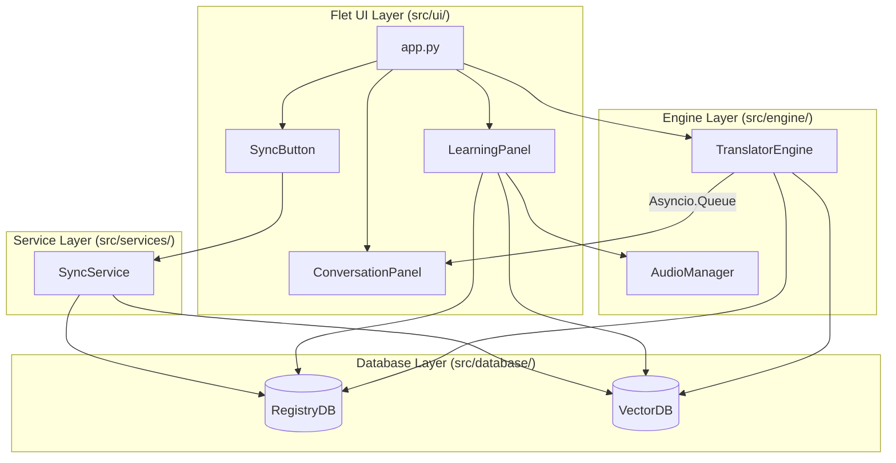

# Component Dependencies

## Dependency Matrix

## Communication Patterns
1. **User Input -> Sync**: Synchronous call from UI to `SyncService`. The UI will display a loading spinner while awaiting the service return.
2. **Microphone -> Engine -> UI**: The `TranslatorEngine` runs continuously in a background thread. It pushes `(text, missing_words)` tuples into an `asyncio.Queue`. The `app.py` runs an async loop checking this queue, triggering UI state updates on `ConversationPanel` when new data arrives. This prevents the STT processing from blocking the UI rendering thread.
