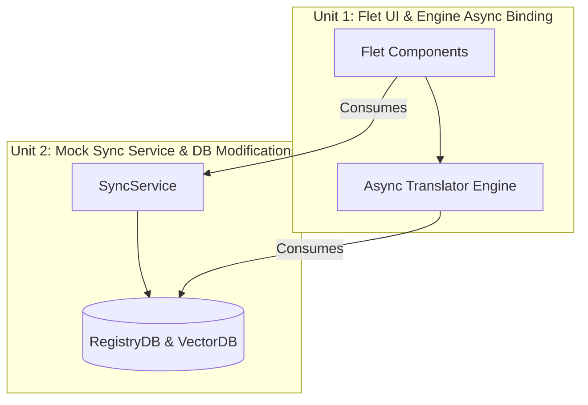

# Unit of Work Dependencies

## Dependency Matrix

## Execution Order Constraints
As decided during the decomposition planning, **Unit 2 (Mock Sync Service & DB Modifications)** will be executed first.
- **Rationale**: Building the UUID migration and Mock Sync Service first ensures that the data layer is robust and all data models are correctly synced before the UI is built. Once the data layer is stable, **Unit 1 (Flet UI & Engine Async Binding)** will be built on top of it.
