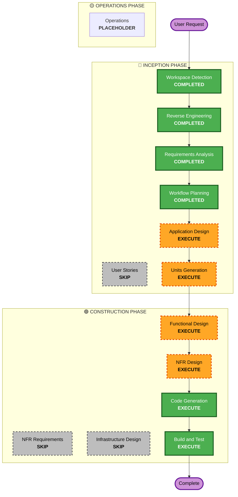

# Execution Plan

## Detailed Analysis Summary

### Transformation Scope (Brownfield Only)
- **Transformation Type**: Architectural (Adding a GUI layer and Cloud Sync layer to an existing CLI backend)
- **Primary Changes**: Creating a Flet UI, integrating it with the existing `Engine` and `Database` modules, and building a Mock Sync engine.
- **Related Components**: `src.engine.translator`, `src.database.registry`, `src.database.vector_db`

### Change Impact Assessment
- **User-facing changes**: Yes - A completely new visual interface replacing CLI scripts.
- **Structural changes**: Yes - Connecting the Flet reactive event loop to the synchronous/asynchronous backend processes.
- **Data model changes**: Yes - Adding `UUID`, `synced`, and `updated_at` to the `RegistryDB`.
- **API changes**: No - Internal APIs remain the same, just consumed by Flet.
- **NFR impact**: Yes - Introduction of UI thread blocking risks (Performance), plus Resiliency and Security baseline enforcements.

### Component Relationships (Brownfield Only)
```markdown
## Component Relationships
- **Primary Component**: `src.ui` (New)
- **Infrastructure Components**: `src.engine.cloud_train` (Existing)
- **Shared Components**: `src.config` (Existing)
- **Dependent Components**: `src.engine` and `src.database` (Existing, to be consumed by UI)
- **Supporting Components**: Supabase Mock Sync (New)
```

### Risk Assessment
- **Risk Level**: High (Merging a heavy deep learning loop and real-time STT loop with a reactive UI framework is complex).
- **Rollback Complexity**: Moderate (We can always revert to CLI scripts).
- **Testing Complexity**: Complex (Requires Property-Based Testing for the new async state).

## Workflow Visualization

### Mermaid Diagram


### Text Alternative
Phase 1: INCEPTION
- Stage 1: Workspace Detection (COMPLETED)
- Stage 2: Reverse Engineering (COMPLETED)
- Stage 3: Requirements Analysis (COMPLETED)
- Stage 4: User Stories (SKIP)
- Stage 5: Workflow Planning (COMPLETED)
- Stage 6: Application Design (EXECUTE)
- Stage 7: Units Generation (EXECUTE)

Phase 2: CONSTRUCTION
- Stage 8: Functional Design (EXECUTE)
- Stage 9: NFR Requirements (SKIP)
- Stage 10: NFR Design (EXECUTE)
- Stage 11: Infrastructure Design (SKIP)
- Stage 12: Code Generation (EXECUTE)
- Stage 13: Build and Test (EXECUTE)

## Phases to Execute

### 🔵 INCEPTION PHASE
- [x] Workspace Detection (COMPLETED)
- [x] Reverse Engineering (COMPLETED)
- [x] Requirements Analysis (COMPLETED)
- [x] User Stories (SKIPPED)
  - **Rationale**: Not needed for this specific UI/Cloud scope.
- [x] Execution Plan (IN PROGRESS)
- [ ] Application Design - EXECUTE
  - **Rationale**: Need to design the Flet component tree and Mock Sync architecture.
- [ ] Units Generation - EXECUTE
  - **Rationale**: Need to plan the specific Python files/classes to be created.

### 🟢 CONSTRUCTION PHASE
- [ ] Functional Design - EXECUTE
  - **Rationale**: State management in Flet (reactive vs procedural) needs strict definition.
- [ ] NFR Requirements - SKIP
  - **Rationale**: Captured natively by the activated AI-DLC Extensions.
- [ ] NFR Design - EXECUTE
  - **Rationale**: Need to design how the Property-Based Testing and Security limits apply to UI forms.
- [ ] Infrastructure Design - SKIP
  - **Rationale**: Cloud Sync is being mocked locally.
- [ ] Code Generation - EXECUTE (ALWAYS)
  - **Rationale**: Implementation planning and code generation needed.
- [ ] Build and Test - EXECUTE (ALWAYS)
  - **Rationale**: Build, test, and verification needed.

### 🟡 OPERATIONS PHASE
- [ ] Operations - PLACEHOLDER
  - **Rationale**: Future deployment and monitoring workflows.

## Package Change Sequence (Brownfield Only)
1. `src.database` - Add UUID and sync logic to SQLite/ChromaDB.
2. `src.engine` - Adapt translator output for async yield to Flet.
3. `src.ui` - Build the Flet frontend binding to the updated engine.

## Estimated Timeline
- **Total Phases**: 6 additional phases
- **Estimated Duration**: 2-3 hours

## Success Criteria
- **Primary Goal**: Fully functioning Flet UI communicating with the local models.
- **Key Deliverables**: `src/ui/app.py`, `src/database/mock_sync.py`, Test suites.
- **Quality Gates**: Property-Based Tests pass, UI does not block during STT transcription.
- **Integration Testing**: All components working together locally offline.
