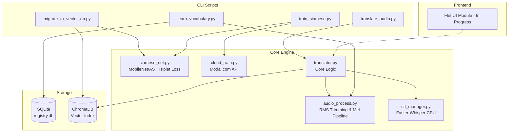
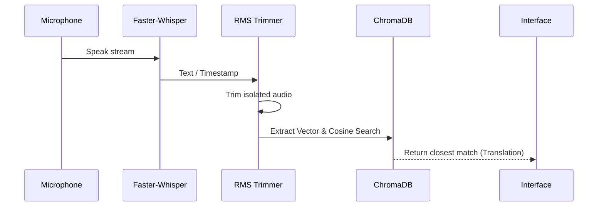

# System Architecture

## System Overview
The Universal Translator is a hybrid Local-First system. It orchestrates real-time audio capture, CPU-based speech transcription, vector storage, and an advanced acoustic Siamese Neural Network capable of computing similarities between completely different sound profiles. Training can be offloaded to serverless cloud GPUs.

## Architecture Diagram

## Component Descriptions
### `src/engine` (Core Engine)
- **Purpose**: Holds the entire deep learning and signal processing logic.
- **Responsibilities**: Audio processing (RMS trimming, spectrograms), training the Siamese model, communicating with the Modal cloud, running Faster-Whisper, and orchestrating the translation query.
- **Dependencies**: Librosa, PyTorch, Faster-Whisper, Modal.
- **Type**: Application/Model

### `src/database` (Storage)
- **Purpose**: Data layer for vector and relational indexing.
- **Responsibilities**: Storing audio mappings and performing high-speed cosine similarity searches.
- **Dependencies**: SQLite3, ChromaDB.
- **Type**: Application/Database

### `scripts` (CLI Executors)
- **Purpose**: Provides the executable points of entry.
- **Responsibilities**: Binding user actions to engine logic.
- **Dependencies**: `src` modules.
- **Type**: Application

## Data Flow

## Integration Points
- **External APIs**: Modal.com (for cloud GPU serverless training).
- **Databases**: Local SQLite, Local ChromaDB (future plan for Supabase sync).
- **Third-party Services**: AudioSet pre-trained weights (HuggingFace) for the AST backbone.

## Infrastructure Components
- **Deployment Model**: Local Python environment with optional serverless cloud bursting via Modal.
- **Networking**: Cloud training communicates via gRPC/HTTPS to Modal instances.
