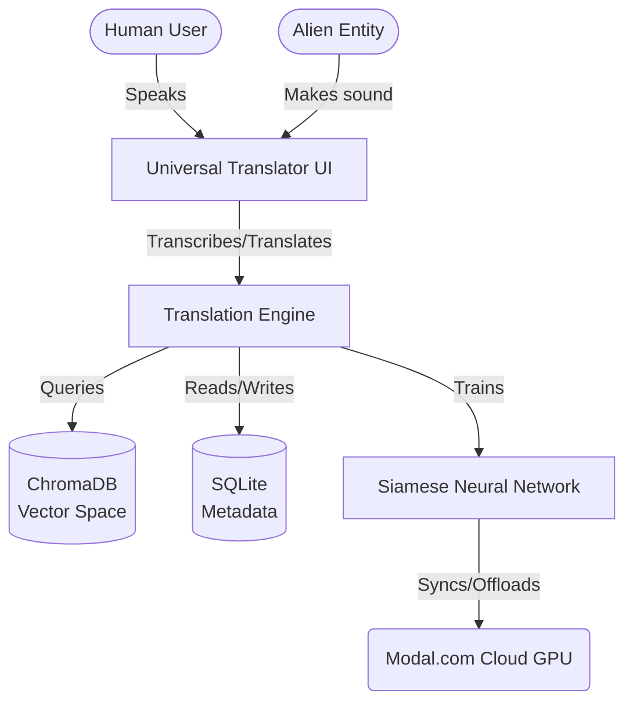

# Business Overview

## Business Context Diagram

## Business Description
- **Business Description**: The system acts as a real-time Universal Translator, capable of mapping and translating between disparate linguistic systems (human speech, alien clicks, animal sounds) by finding conceptual similarity in a shared latent space rather than literal phonetic equivalence.
- **Business Transactions**:
  - **Learn Vocabulary**: Registering new sound-to-meaning pairs using few-shot learning (recording human anchor words and corresponding alien sounds).
  - **Model Training**: Updating the Siamese Neural Network weights locally or on the cloud to group sounds with identical semantic intents together.
  - **Vector Syncing**: Re-encoding the raw audio database into 1024-dimensional space using the newly trained brain.
  - **Real-Time Translation**: Continuously transcribing speech via STT, splitting by RMS energy, and performing real-time Cosine Similarity lookups to translate.
- **Business Dictionary**:
  - **Few-Shot Learning**: Adding new vocabulary pairs with minimal audio samples.
  - **Missing Words**: Gaps in the latent space where no vector matches the transcribed or heard sound.
  - **Anchor/Positive/Negative**: The triplet structures used to train the network (Human word, matching Alien sound, non-matching Alien sound).

## Component Level Business Descriptions
### Engine (`src/engine/`)
- **Purpose**: Implements the core machine learning and audio processing tasks.
- **Responsibilities**: Trimming audio by energy (RMS), computing Mel Spectrograms, defining the Siamese architecture, handling local/cloud training, and managing STT translation loops.

### Database (`src/database/`)
- **Purpose**: Persists all knowledge.
- **Responsibilities**: Tracking audio metadata via SQLite and managing the HNSW vector space via ChromaDB.

### Scripts (`scripts/`)
- **Purpose**: Provides operational CLI transactions for the human user.
- **Responsibilities**: Executing vocabulary learning, model training, database synchronization, and starting the translation session.
