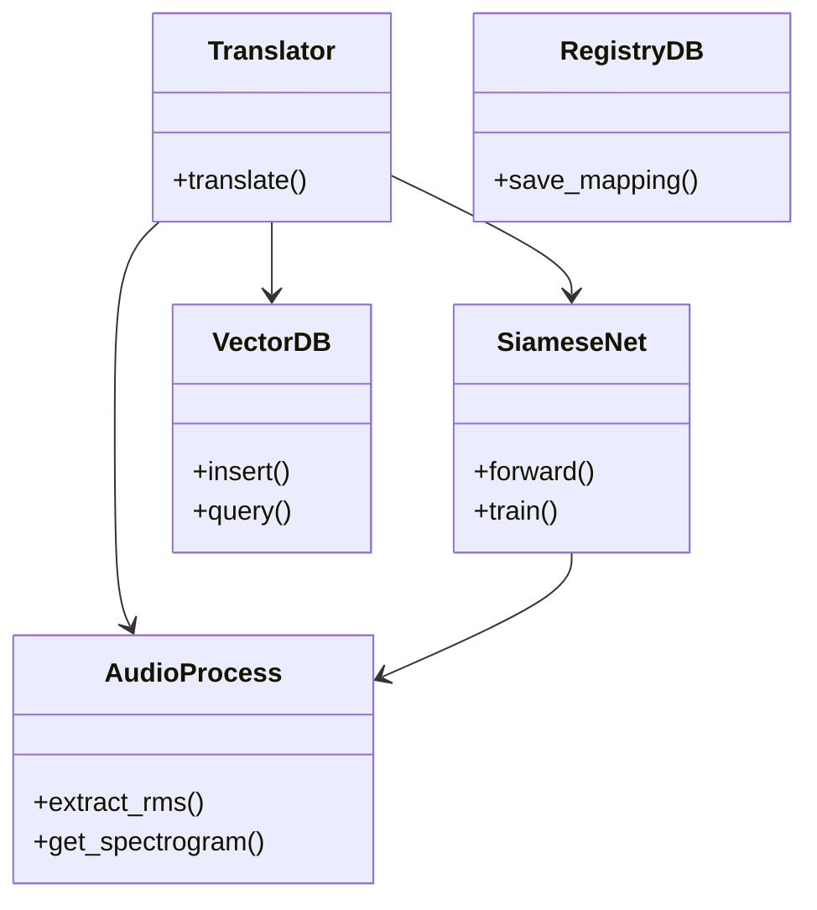

# Code Structure

## Build System
- **Type**: Python setuptools / pip
- **Configuration**: `requirements.txt` holds package dependencies.

## Key Classes/Modules

### Existing Files Inventory
- `src/config.py` - Main configuration values and constants.
- `src/main.py` - Core execution or overarching loop.
- `src/engine/audio_process.py` - Signal processing (RMS, Mel Spectrograms).
- `src/engine/cloud_train.py` - Wrapper for Modal.com cloud execution.
- `src/engine/siamese_net.py` - PyTorch models (MobileNetV2, AST), Triplet Loss.
- `src/engine/stt_manager.py` - Faster-Whisper abstraction for transcription.
- `src/engine/translator.py` - Logic tying STT, Audio, and DB together.
- `src/database/registry.py` - SQLite operations.
- `src/database/vector_db.py` - ChromaDB interactions.
- `scripts/learn_vocabulary.py` - CLI for recording words.
- `scripts/train_siamese.py` - CLI for triggering model training.
- `scripts/migrate_to_vector_db.py` - CLI to sync SQLite to ChromaDB.
- `scripts/translate_audio.py` - CLI for real-time translation loop.

## Design Patterns
### Singleton / Facade
- **Location**: `src/database/registry.py` and `vector_db.py`
- **Purpose**: Provides a unified, single point of entry to DB operations.
- **Implementation**: Class instances wrapping SQLite/Chroma connections.

## Critical Dependencies
### PyTorch
- **Usage**: Deep learning engine for the Siamese network.
- **Purpose**: Tensor calculations and gradient descent via Triplet Margin Loss.
### Librosa
- **Usage**: Audio processing in `audio_process.py`.
- **Purpose**: Generating Mel Spectrograms.
### Modal
- **Usage**: `cloud_train.py`
- **Purpose**: Offloading PyTorch training to serverless GPUs.
