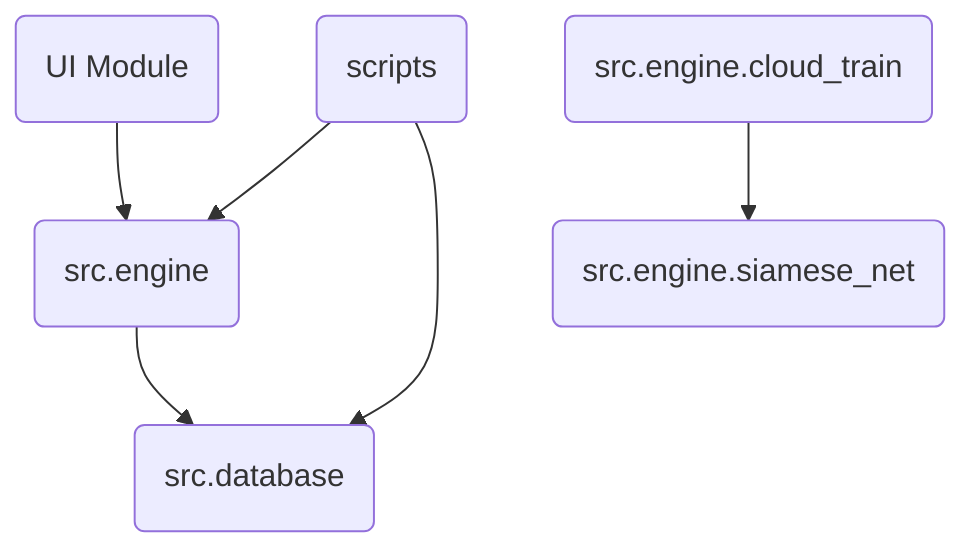

# Dependencies

## Internal Dependencies

### `scripts` depends on `src`
- **Type**: Runtime
- **Reason**: Executes the core functionality.

## External Dependencies
### `faster-whisper`
- **Purpose**: Local transcription on CPU.
- **License**: MIT
### `librosa`
- **Purpose**: Spectral audio manipulation.
- **License**: ISC
### `torch`
- **Purpose**: Siamese network execution and training.
- **License**: BSD
### `chromadb`
- **Purpose**: Fast cosine similarity querying.
- **License**: Apache 2.0
### `modal`
- **Purpose**: Offloading ML workloads to the cloud.
- **License**: Proprietary (SaaS)
