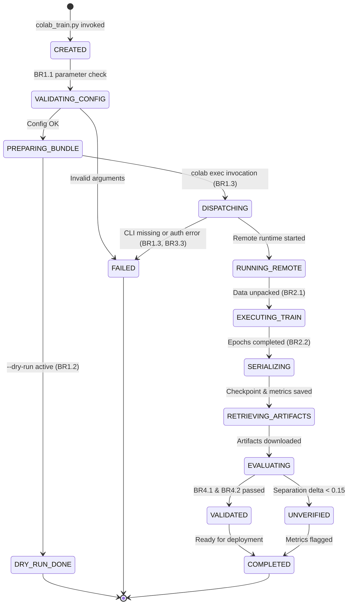
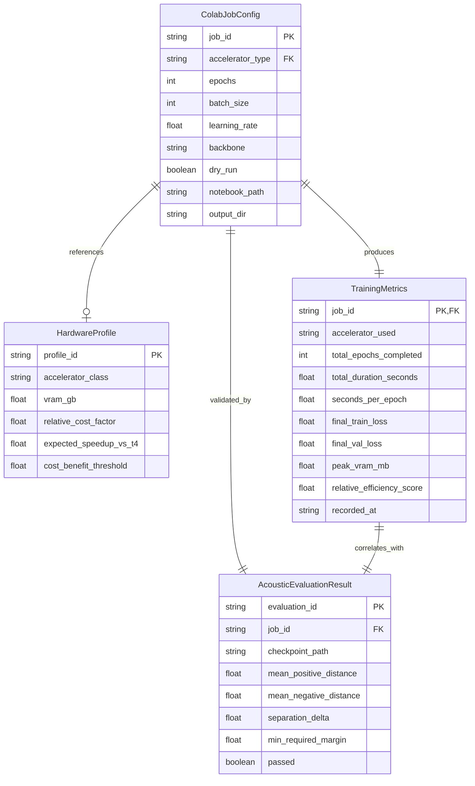

# Functional Specification: Google Colab Cloud Training & Progressive Benchmarking

## Architectural Overview & Workflows

This functional specification governs the orchestration, remote execution, and acoustic validation of neural acoustic models on Google Colab using the Google Colab CLI (`colab exec`).

### Workflow 1: Local Job Orchestration & Dispatch

The primary workflow initiates on the local development workstation when executing `src/engine/colab_train.py`:

1. **CLI Parsing & Configuration**: Parse command-line arguments (`--gpu`, `--epochs`, `--batch-size`, `--backbone`, `--dry-run`, `--output-dir`) and instantiate `ColabJobConfig`.
2. **Input Validation**: Enforce Rule **BR1.1**. Validate that values are strictly positive and that the requested accelerator belongs to the active `HardwareProfile` catalog.
3. **Training Bundle Assembly**:
   - Collect acoustic dataset files from `linguagens/` (or verify their presence).
   - Package source code modules (`src/engine/siamese_net.py`) and audio assets into an upload bundle or staging directory.
   - Synchronize with the versioned notebook template `notebooks/colab_train_siamese.ipynb`.
4. **Execution Dispatch**:
   - IF `--dry-run` is active: Execute Rule **BR1.2**. Verify local file structure, print simulated execution summary, and terminate cleanly without invoking external processes.
   - IF `--dry-run` is false: Execute Rule **BR1.3**. Verify presence of the `colab` CLI executable in the system PATH. Spawn the `colab exec` process referencing the target notebook and requested accelerator runtime.
5. **Real-Time Stream Processing**: Capture stdout/stderr streams from the subprocess, displaying epoch progress, training loss, and elapsed time to the developer console.
6. **Artifact Retrieval**: Post-execution, download or copy the generated weights (`siamese_colab.pth`) and execution metrics (`training_metrics.json`) into the local output directory (`models/colab_runs/`).

### Workflow 2: Colab Remote Execution & Triplet Optimization

Executed autonomously within the Google Colab compute environment (headless via CLI or interactively via browser):

1. **Cell 1 (Environment Detection & Dependencies)**:
   - Check if runtime is Google Colab (`google.colab` present).
   - Install required packages (`torchaudio`, `transformers`, `librosa`, `scipy`).
   - Identify active GPU/TPU device using `torch.cuda.get_device_name()` or PyTorch XLA.
2. **Cell 2 (Data Unpacking & Audio Indexing)**:
   - Extract audio archive into local temporary disk (`/content/linguagens/`).
   - Index audio paths for human, dolphin, and bat vocalizations.
   - Validate that audio counts match expected dataset thresholds (Rule **BR2.1**).
3. **Cell 3 (Siamese Architecture & Transforms)**:
   - Load `UniversalTranslatorSiameseNet` with the configured backbone (MobileNet-V3 or AST).
   - Initialize `AcousticTransformPipeline` (16kHz resampling, Mel-spectrogram extraction, specaugment).
4. **Cell 4 (Progressive Triplet Training Loop)**:
   - Initialize `InterspeciesTripletDataset` and PyTorch DataLoader.
   - Record start timestamp.
   - Loop over epochs: compute Anchor, Positive, Negative forward passes; compute Triplet Margin Loss; backpropagate and step optimizer.
   - Profile epoch duration and peak VRAM.
5. **Cell 5 (Metrics & Checkpoint Serialization)**:
   - Enforce Rule **BR2.2**.
   - Serialize model state dictionary to `models/siamese_colab.pth`.
   - Export JSON metrics to `training_metrics.json` containing total duration, seconds/epoch, and loss history.
6. **Cell 6 (Standalone Verification)**:
   - Execute forward pass on test triplets to verify non-trivial embeddings before closing runtime.

### Workflow 3: Post-Training Benchmark & Acoustic Validation

Executed locally or remotely after completion:

1. **Integrity Verification**: Inspect the downloaded `.pth` file using Rule **BR4.1**, verifying PyTorch compatibility and non-empty weight dictionaries.
2. **Hardware Benchmark Evaluation**:
   - Extract `seconds_per_epoch` from `training_metrics.json`.
   - Compare with baseline T4 profile.
   - Apply Rule **BR3.2** to compute relative efficiency and output hardware cost-benefit guidance.
3. **Acoustic Separation Test**:
   - Load Siamese model into evaluation mode (`eval()`).
   - Project validation audio pairs into 128-dimensional embedding space.
   - Calculate mean positive cosine distance ($D_{pos}$) and mean negative cosine distance ($D_{neg}$).
   - Evaluate separation delta: $\Delta = D_{neg} - D_{pos}$.
   - Apply Rule **BR4.2**: Assert $\Delta \ge 0.15$.
4. **Summary Reporting**: Output consolidated benchmark table and validation verdict (`PASSED` / `FAILED`).

---

## State Machine: Colab Job Lifecycle

---

## Derived Entity-Relationship Diagram

---

## Derived Rules Summary

- **Configuration & CLI**: **BR1.1** (argument validation), **BR1.2** (dry-run isolation), **BR1.3** (colab process execution & error handling).
- **Notebook & Runtime**: **BR2.1** (autonomous setup & data extraction), **BR2.2** (triplet loss & checkpoint serialization).
- **Hardware & Cost Efficiency**: **BR3.1** (baseline T4 preference), **BR3.2** (cost-benefit threshold $\ge 1.25$), **BR3.3** (quota exhaustion fallback).
- **Validation & Quality**: **BR4.1** (checkpoint integrity), **BR4.2** (separation margin $\Delta \ge 0.15$), **BR4.3** (credential security).
